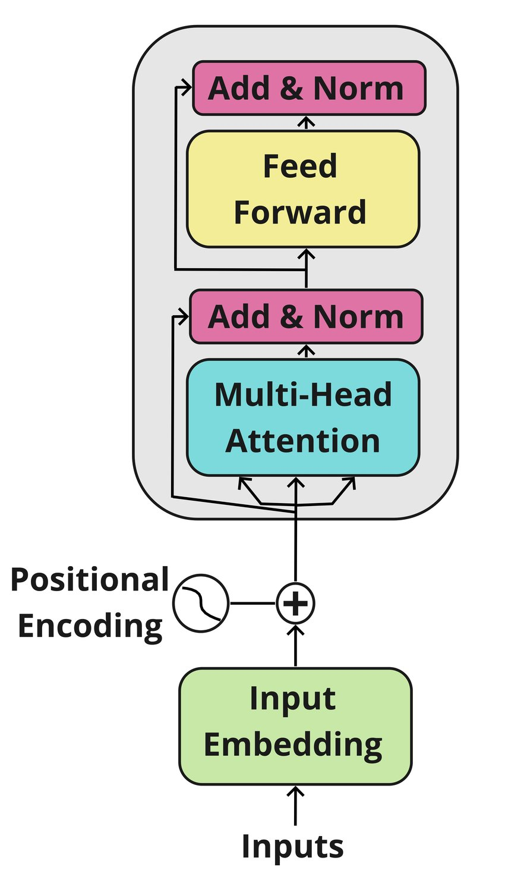

<h1 align="center"><strong>Encoder Transformer Block Implementation</strong></h1>

## Overview

Welcome to the **Encoder-Transformer-Block** repository. This project implements an Encoder Transformer block from scratch using PyTorch, without relying on pre-built transformer modules. This implementation is designed for use in a larger transformer-based model for natural language processing tasks.

<p align="center">
  
</p>

## Task Description

The objective of this project is to implement an Encoder Transformer block that includes:

1. **Multi-head Attention Mechanism**: Allows the model to focus on different parts of the input sequence simultaneously.
2. **Position-wise Feed-Forward Network**: Processes each position in the sequence independently.
3. **Layer Normalization**: Normalizes the activations of the previous layer.
4. **Residual Connections**: Adds the input of each sub-layer to its output to help with gradient flow.

## Implementation Details

### `encoder_block.py`

The `encoder_block.py` file contains the `EncoderBlock` class with the following features:

- **Parameters**:
  - `d_model`: Dimension of the input and output embeddings.
  - `num_heads`: Number of attention heads.
  - `d_ff`: Dimension of the feed-forward network.
  - `dropout`: Dropout rate.

- **Components**:
  - **Multi-Head Attention Mechanism**: Implemented in `multihead_attention.py`.
  - **Position-Wise Feed-Forward Network**: Integrated into the encoder block.
  - **Layer Normalization**: Implemented in `layer_normalization.py`.
  - **Residual Connections**: Incorporated to enhance gradient flow and model stability.

### `test_encoder_block.py`

This file contains basic tests and demonstrations of how to use the `EncoderBlock` class. It verifies the functionality of the encoder block and ensures that the implementation behaves as expected.

### `requirements.txt`

Lists all necessary Python libraries and dependencies for running the code, including PyTorch.

## Usage Instructions

1. **Clone the Repository**:
   - Clone this repository to your local machine using Git:

     ```bash
     git clone https://github.com/mehmetalpayy/Encoder-Transformer-Block.git
     cd Encoder-Transformer-Block
     ```

2. **Install Dependencies**:
   - Ensure you have Python 3.8 installed. Install the required libraries using pip:

     ```bash
     python3 -m pip install -r requirements.txt
     ```

3. **Run Tests**:
   - Execute the test suite to validate the implementation:

     ```bash
     python3 test_encoder_block.py
     ```

## Architecture and Design Decisions

- **Multi-Head Attention**: Implements attention with multiple heads to capture various aspects of the input sequence.
- **Position-Wise Feed-Forward Network**: Processes each position independently with a two-layer feed-forward network.
- **Layer Normalization**: Applies layer normalization to stabilize and accelerate training.
- **Residual Connections**: Adds the input of each sub-layer to its output to facilitate gradient flow and model stability.

**Modularity**: The code is organized into modular components (e.g., multi-head attention, layer normalization) for easier maintenance and testing.

## Limitations and Future Work

- **Performance Optimization**: Performance Optimization: The performance of the EncoderBlock could be enhanced by experimenting with various hyperparameters such as the number of attention heads, the dimensionality of the feed-forward network, and dropout rates. Additionally, exploring more advanced techniques in multi-head attention or feed-forward network design could lead to performance improvements.

- **Error Handling**: Improve error handling to manage unexpected inputs and edge cases better. This includes adding checks for input shapes and providing clear error messages when something goes wrong.

## Contribution

If you would like to contribute to this project, please follow these steps:

1. Fork the repository.
2. Create a new branch for your changes.
3. Make your modifications and commit them.
4. Submit a pull request with a detailed description of the changes.

## Contact

For any questions or feedback, please contact me at [mehmetcompeng@gmail.com](mailto:mehmetcompeng@gmail.com).

---

Thank you for visiting the Encoder-Transformer-Block repository. I hope you find the implementation useful and informative!
